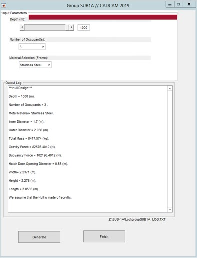
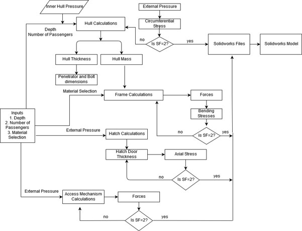

# Parameterization of a 3D Manned Submersible

Figure 1: Solidwork Overall Design and Subparts

Figure 2: Parameterization UI

Figure 3: Main Design CodeFlow Chart

## Description
* Capstone Project : Matlab Parameterization of a 3D Modelling of an Unmanned Submersible.
* Parameterization is used to quickly change the dimensions and properties of the 3D model for 
different application, such as depth, speed, environment, and for user intentions, such as 
recreational, tourism, research.
* FEA static analysis on Abaqus is validated using Matlab

## Dependencies
* SolidWorks
* Matlab

## Usage
* Matlab has to be linked with soldiworks.
* Open the MATLAB folder in the repository.
* Open and run Main.m. This will automatically open MAIN.fig which is the parameterization UI. If not, open manually.
* Choose your desired input parameters based on your application and click "Generate".
* This automatically updates the dimensions of the solidwork model.

## Author
* Jonas Chianu