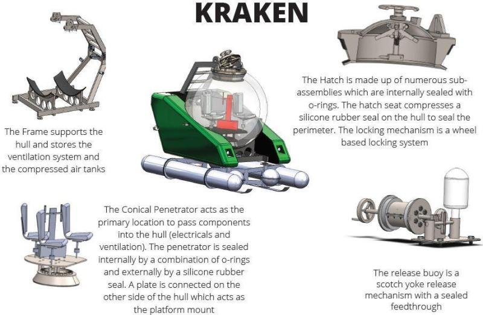

# Parameterization of a 3D manned Submersible

## Description
* Capstone Project : Matlab Parameterization of a 3D Modelling of an Unmanned Submersible.
* Parameterization is used to quickly change the dimensions and properties of the 3D model for 
different application, such as depth, speed, environment, and for user intentions, such as 
recreational, tourism, research.

## Usage
* This is intended to be used with a 3d solidworks model of a submarine.

## Author
* Jonas Chianu